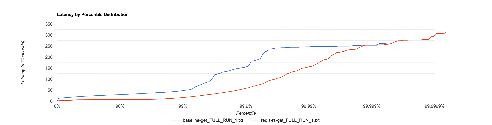

[](https://app.codecrafters.io/users/codecrafters-bot?r=2qF)

This project is a Rust implementation of a Redis clone, developed as part of the ["Build Your Own Redis" Challenge](https://codecrafters.io/challenges/redis).

It aims to replicate core Redis functionalities, including event loops and the Redis Serialization Protocol (RESP).

**Note**: If you're viewing this repo on GitHub, head over to
[codecrafters.io](https://codecrafters.io) to try the challenge.

# Performance Benchmarks 📊

This Redis implementation has been benchmarked against the official Redis server to measure performance characteristics. The benchmarks focus on read throughput using the `memtier_benchmark` tool with configuration guidelines inspired by [Microsoft Azure’s Redis best practices](https://learn.microsoft.com/en-us/azure/redis/best-practices-performance).

## Benchmark Configuration

- **Tool**: `memtier_benchmark`
- **Test Duration**: 60 seconds
- **Threads**: 6
- **Connections**: 50 per thread (300 total)
- **Pipeline**: 10 commands
- **Data Size**: 1024 bytes
- **Key Space**: ~1.7M keys
- **Operation**: GET commands (read-heavy workload)

## Results

The latency distribution comparison shows competitive performance between this Rust implementation and the official Redis server:



**Summary**: For the majority of requests (P0-P99.999), this implementation achieves **lower latency** than the official Redis server, while maintaining similar performance at higher percentiles.

## Running Benchmarks

To run the benchmarks yourself:

```bash
./benchmark/benchmark.sh
```

The script will:
1. Run benchmarks against the official Redis server (baseline)
2. Run benchmarks against this Rust implementation
3. Generate HDR histogram files for detailed latency analysis
4. Output results to the `benchmark/out/` directory
5. Generate a plot of the results using the output `.txt` files: https://hdrhistogram.github.io/HdrHistogram/plotFiles.html

### Prerequisites

- `redis-cli` installed
- `memtier_benchmark` installed (`brew install memtier_benchmark` on macOS)
- Official Redis server installed (`brew install redis` on macOS)

# Features ✨

This Redis clone supports the following features:
-   **Basic Commands** ⌨️:
    -   `PING`: Checks server responsiveness.
    -   `ECHO`: Returns the provided string.
    -   `SET`: Stores a key-value pair.
    -   `GET`: Retrieves the value associated with a key.
    -   `INCR`: Increments the integer value of a key by one.
    -   `INFO`: Provides information about replication.
    -   `REPLCONF`: Used for replication configuration.
    -   `PSYNC`: Facilitates partial or full resynchronization with a replica.
    -   `WAIT`: Blocks until all previous write commands are successfully transferred and acknowledged by the specified number of replicas.
    -   `CONFIG GET`: Retrieves configuration parameters.
    -   `KEYS`: Returns all keys matching a pattern.
    -   `TYPE`: Returns the string representation of the type of the value stored at key.
    -   `DBSIZE`: Returns the number of keys in the database.
    -   `FLUSHALL`: Removes all keys from all databases.
    -   `COMMAND`: Returns details about all Redis commands.
-   **Transactions** 💳:
    -   `MULTI`: Marks the start of a transaction block.
    -   `EXEC`: Executes all commands issued after MULTI.
    -   `DISCARD`: Discards all commands issued after MULTI.
-   **Lists** 📝:
    -   `LPUSH`: Inserts elements at the head of a list.
    -   `RPUSH`: Inserts elements at the tail of a list.
    -   `LPOP`: Removes and returns the first element of a list.
    -   `LLEN`: Returns the length of a list.
    -   `LRANGE`: Returns a range of elements from a list.
    -   `BLPOP`: Blocking version of LPOP that waits for elements.
-   **Sorted Sets** 🔢:
    -   `ZADD`: Adds members with scores to a sorted set.
    -   `ZREM`: Removes members from a sorted set.
    -   `ZRANGE`: Returns a range of members from a sorted set by index.
    -   `ZRANK`: Returns the rank of a member in a sorted set.
    -   `ZSCORE`: Returns the score of a member in a sorted set.
    -   `ZCARD`: Returns the number of members in a sorted set.
-   **Geospatial Commands** 🌍:
    -   `GEOADD`: Adds geospatial items (longitude, latitude, name) to a sorted set.
    -   `GEODIST`: Returns the distance between two members of a geospatial index.
    -   `GEOPOS`: Returns longitude and latitude of members from a geospatial index.
    -   `GEOSEARCH`: Searches for members within a geospatial index.
-   **Streams** 🌊:
    -   `XADD`: Appends a new entry to a stream.
    -   `XRANGE`: Returns a range of entries from a stream.
    -   `XREAD`: Reads entries from one or more streams.
-   **Pub/Sub** 📢:
    -   `PUBLISH`: Posts a message to a channel.
    -   `SUBSCRIBE`: Subscribes the client to the given channels.
    -   `UNSUBSCRIBE`: Unsubscribes the client from the given channels.
-   **Concurrency** ⚡: Utilizes an event loop model to handle multiple client connections concurrently.
-   **RESP Protocol** 🗣️: Communicates with clients using the Redis Serialization Protocol (RESP).
-   **Persistence** 💾: Supports RDB file persistence to save and load data.
-   **Replication** 🔄: Implements master-replica replication for data redundancy and read scaling.
-   **Pipelining** 🚀: Supports sending multiple commands without waiting for responses, improving throughput for batch operations.
