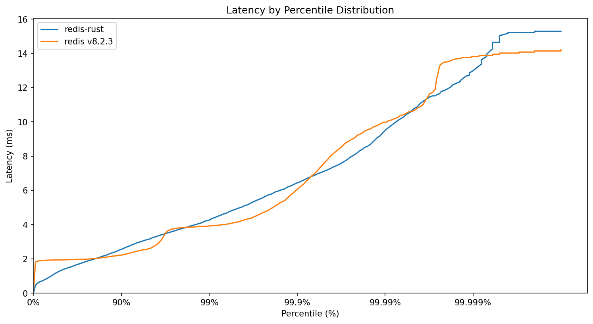
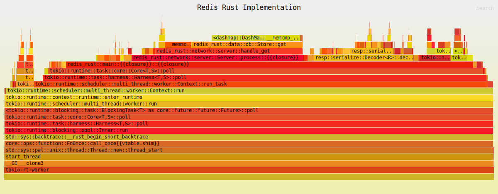
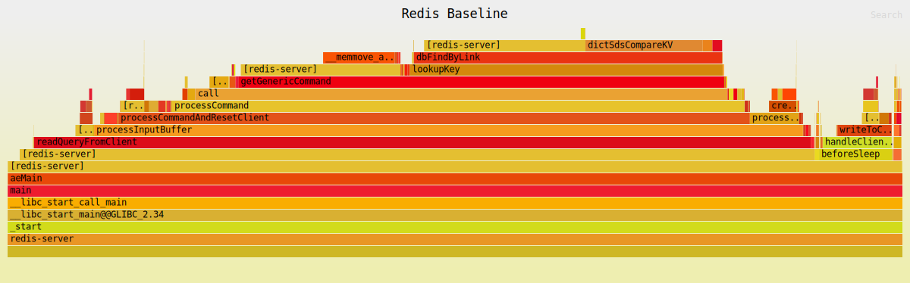

[](https://app.codecrafters.io/users/codecrafters-bot?r=2qF)

This project is a Rust implementation of a Redis clone, developed as part of the ["Build Your Own Redis" Challenge](https://codecrafters.io/challenges/redis).

It aims to replicate core Redis functionalities, including event loops and the Redis Serialization Protocol (RESP).

**Note**: If you're viewing this repo on GitHub, head over to
[codecrafters.io](https://codecrafters.io) to try the challenge.

# Performance Benchmarks 📊

This Redis implementation has been benchmarked against Redis server v8.2.3 (jemalloc-5.3.0) to measure both throughput and latency characteristics using the `memtier_benchmark` tool with configuration guidelines inspired by [Microsoft Azure's Redis best practices](https://learn.microsoft.com/en-us/azure/redis/best-practices-performance).

## Throughput Benchmark

### Configuration

- **Test Duration**: 60 seconds
- **Threads**: 6
- **Connections**: 50 per thread (300 total)
- **Pipeline**: 10 commands
- **Data Size**: 1024 bytes
- **Key Space**: ~1.7M keys
- **Operation**: GET only

### Results

| Implementation          | Ops/sec | KB/sec  | Avg Latency (ms) |
| ----------------------- | ------- | ------- | ---------------- |
| **Redis (Baseline)**    | 293,225 | 305,637 | 10.2             |
| **Rust Implementation** | 397,667 | 414,500 | 7.5              |
| **Improvement**         | +35%    | +35%    | +26%             |

## Latency Benchmark

### Configuration

- **Threads**: 4
- **Connections**: 50 per thread (200 total)
- **Pipeline**: 1 command
- Rest same as throughput benchmark

### Results



| Implementation          | Mean (ms) | p50 (ms) | p99 (ms) | p99.9 (ms) |
| ----------------------- | --------- | -------- | -------- | ---------- |
| **Redis (Baseline)**    | 2.04      | 1.94     | 3.92     | 6.08       |
| **Rust Implementation** | 1.44      | 1.30     | 4.29     | 6.43       |
| **Improvement**         | +29%      | +33%     | -9%      | -6%        |

## Running Benchmarks

To run the benchmarks yourself:

```bash
./benches/benchmark.sh
```

The script will:

1. Run **throughput benchmarks** against both Redis baseline and Rust implementation
2. Run **latency benchmarks** against both implementations
3. Generate HDR histogram files for detailed latency analysis
4. Output results to the `benches/out/` directory
5. Generate the latency percentile chart at `assets/latency.png`

## Flamegraphs

### Rust Implementation



### Baseline



### Prerequisites

- `redis-cli` installed
- `memtier_benchmark` installed (`brew install memtier_benchmark` on macOS)
- Official Redis server installed (`brew install redis` on macOS)

# Features

## Basic Commands

- `PING`: Checks server responsiveness.
- `ECHO`: Returns the provided string.
- `SET`: Stores a key-value pair with optional expiry.
- `GET`: Retrieves the value associated with a key.
- `INCR`: Increments the integer value of a key by one.
- `KEYS`: Returns all keys matching a pattern.
- `TYPE`: Returns the type of the value stored at a key.
- `DBSIZE`: Returns the number of keys in the database.
- `FLUSHALL`: Removes all keys from all databases.
- `CONFIG GET`: Retrieves configuration parameters.
- `COMMAND`: Returns details about all Redis commands.

## Transactions

- `MULTI`: Marks the start of a transaction block.
- `EXEC`: Executes all queued commands, or aborts if watched keys were modified.
- `DISCARD`: Discards all queued commands and exits transaction mode.
- `WATCH`: Monitors keys for changes to implement optimistic locking.
- `UNWATCH`: Clears all watched keys for the connection.

## Authentication

- `AUTH`: Authenticates the client connection.
- `ACL`: Manages access control lists.

## Lists

- `LPUSH`: Inserts elements at the head of a list.
- `RPUSH`: Inserts elements at the tail of a list.
- `LPOP`: Removes and returns elements from the head of a list.
- `LLEN`: Returns the length of a list.
- `LRANGE`: Returns a range of elements from a list.
- `BLPOP`: Blocking version of LPOP that waits for elements.

## Sorted Sets

- `ZADD`: Adds members with scores to a sorted set.
- `ZREM`: Removes members from a sorted set.
- `ZRANGE`: Returns a range of members by index.
- `ZRANK`: Returns the rank of a member.
- `ZSCORE`: Returns the score of a member.
- `ZCARD`: Returns the number of members.

## Geospatial

- `GEOADD`: Adds geospatial items (longitude, latitude, name) to a sorted set.
- `GEODIST`: Returns the distance between two members.
- `GEOPOS`: Returns longitude and latitude of members.
- `GEOSEARCH`: Searches for members within a radius or bounding box.

## Streams

- `XADD`: Appends a new entry to a stream.
- `XRANGE`: Returns a range of entries from a stream.
- `XREAD`: Reads entries from one or more streams, with optional blocking.

## Pub/Sub

- `PUBLISH`: Posts a message to a channel.
- `SUBSCRIBE`: Subscribes the client to one or more channels.
- `UNSUBSCRIBE`: Unsubscribes the client from channels.

## Replication

- `INFO`: Returns replication state and role information.
- `REPLCONF`: Configures replication parameters.
- `PSYNC`: Initiates partial or full resynchronization with a replica.
- `WAIT`: Blocks until write commands are acknowledged by replicas.

## Architecture

- **Concurrency**: Async I/O with Tokio for concurrent client connections.
- **RESP Protocol**: Full Redis Serialization Protocol support.
- **Persistence**: RDB file loading for data recovery.
- **Pipelining**: Batch command processing for improved throughput.
